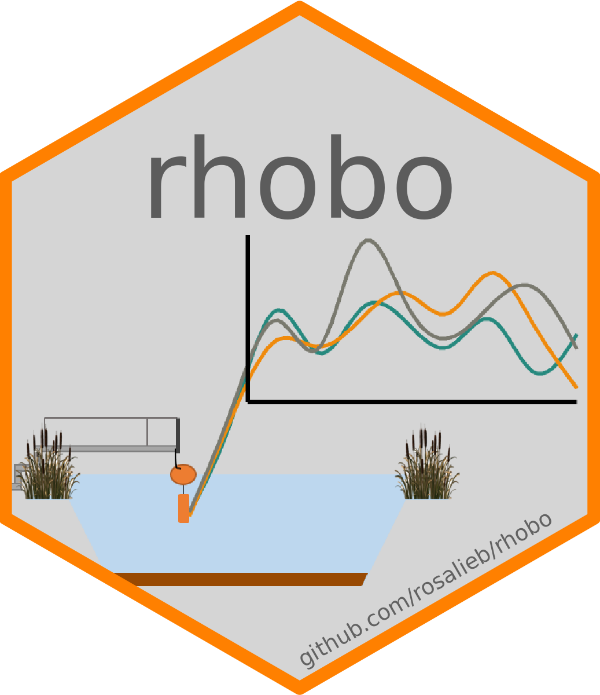

<!-- README.md is generated from README.Rmd. Please edit that file -->

```{r, include = FALSE}
knitr::opts_chunk$set(
  collapse = TRUE,
  comment = "#>",
  fig.path = "man/figures/README-",
  out.width = "100%"
)

pacman::p_load(ggplot2, tidyr, dplyr, stringr, lubridate, LakeMetabolizer)

```

<!-- badges: start -->
<!-- badges: end -->

# rhobo <a href="https://github.com/rosalieb/rhobo" target="_blank"></a>

The goal of rhobo is to read in the raw HOBO files downloaded through the HOBO software and compute the dissolved oxygen correction factors. Functions are also included to help append new data to previous data files. 

The steps match the routine for data from the artificial lakes at the [CEREEP-Ecotron](https://www.cereep.bio.ens.psl.eu/spip.php?article45), and may need to be adapted to other datasets format to be widely usable. 

__Authors__: Rosalie Bruel (iEES-Paris, CNRS, France) and Sophie Guillon (Mines ParisTech, France)


## Installation

You can install the development version from [GitHub](https://github.com/) with:

```
# install.packages("devtools")
devtools::install_github("rosalieb/rhobo")
library(rhobo)
```

```{r install and load package, eval = TRUE, include=FALSE}
# install.packages("devtools")
devtools::install_github("rosalieb/rhobo")
library(rhobo)
```
## Example

None of the following code will run unless you have data in your home folder.
You can access the desired structure of the home repository by running `struct.dir()`.

```{r echo=FALSE}
struct.dir()
```


### 1 - Set and check your input

First, you need to specify a certain number of inputs associated with sensors deployment:


```{r example}
# Start editing here
foldername = "2021_07_27" # Name of the folder with data unloaded. Typically, folder named YYYY_MM_DD using the date of the field mission.
Append = format(as.Date(foldername, format = "%Y_%m_%d"), format = "%Y%m") # To respect the format, create the append that will be added to each QAQC'd file
TC_pre = "2021/05/07 13:10:00" # Time calibration pre-deployment, after the calibration bucket # before measurements
TM_init = "2021/05/07 13:40:00" # Time measurement init # when probes are back in the lakes
TM_end = "2021/07/27 07:50:00" # Time measurement end # when probes are taken out of the lakes
TC_post = "2021/07/27 09:15:00" # Time calibration end of measurements (post deployment)
Pbaro_mbar_init = 756.2 *1013/760 # P in millibar
Pbaro_mbar_end = 752.6 *1013/760 # P in millibar
# Stop editing here

```

The timeline showing the succession of event is shown below.

```{r plot with all the important measurements, echo=FALSE}
dt <- data.frame(
  dates = c(0,15),
  y = c(-3.8,4)
)

par(mar = c(0,1,2,0))
plot(dt$dates,dt$y, type = "n", axes = FALSE, xlab = "", ylab = "")

# Add rectangle in/out of water
rect(xleft = 0, xright = 2, ybottom = -2, ytop = 4, density = NA, col =  grey(.9))
rect(xleft = 2, xright = 6, ybottom = -2, ytop = 4, density = NA, col = "#ADD8E6")
rect(xleft = 6, xright = 10, ybottom = -2, ytop = 4, density = NA, col = grey(.9))
rect(xleft = 10, xright = 14, ybottom = -2, ytop = 4, density = NA, col = "#ADD8E6")
rect(xleft = 14, xright = 15, ybottom = -2, ytop = 4, density = NA, col = grey(.9))

# Add legend
legend("bottomright", legend = c("HOBO in water","HOBO out of water", "calibration", "deployment"), fill = c("#ADD8E6", grey(.8), NA, NA), pch = c(NA,NA,19,17), border = NA, bty = "n")

# Add basic timeline
lines(x=c(0,2.5), y = c(1,1), lwd = 2)
lines(x=c(2,6), y = c(1,1), lty =2, lwd = 2)
lines(x=c(5.5,10.5), y = c(1,1), lwd = 2)
lines(x=c(10,14), y = c(1,1), lty =2, lwd = 2)
arrows(x0 = 13.5, y0 = 1, x1 = 15, y1 = 1, length = .1, lwd = 2)

# Add deployment arrow and legend
arrows(x0 = 2, x1 = 6, y0 = -0.2, y1 = -0.2, length = .1, code=3)
text(x=4, y=-0.2, label = "deployment\n(typically 3 months)", pos = 1)
arrows(x0 = 10, x1 = 14, y0 = -0.2, y1 = -0.2, length = .1, code=3)
text(x=12, y=-0.2, label = "deployment", pos = 1)

# Add calibration before
points(1, 1, pch = 1, cex = 2)
text(1, 1, label = "'TC_pre'", pos = 1,cex = .9, offset = .4)
# Add start deployment 
points(2, 1, pch = 2, cex = 2)
text(2, 1, label = "'TM_init'", pos = 3,cex = .9, offset = .8)

# Add end deployment
points(6, 1, pch = 17, cex = 2)
text(6, 1, label = "'TM_end'", pos = 3,cex = .9, offset = .8)
# Add calibration after
points(7, 1, pch = 19, cex = 2)
text(7-0.2, 1, label = "'TC_post'", pos = 1,cex = .9, offset = .4)
# Add calibration before
points(9, 1, pch = 19, cex = 2)
text(9+0.2, 1, label = "'TC_pre'", pos = 1,cex = .9, offset = .4)
# Add start deployment 
points(10, 1, pch = 17, cex = 2)
text(10, 1, label = "'TM_init'", pos = 3,cex = .9, offset = .8)

# Add end deployment
points(14, 1, pch = 2, cex = 2)
text(14, 1, label = "'TM_end'", pos = 3,cex = .9, offset = .8)

# Add day of mission
arrows(x0 = 6, x1 = 10, y0 = 2.2, y1 = 2.2, length = .1, code=3)
text(x=(6+10)/2, y=2.2, label = "day of mission\n(gives its name to\n'foldername')", pos = 3)

# Add title
mtext("Timeline of deployment and calibration", side = 3, adj = 0)
text(-0.3, -2.4, label = " 'Pbaro_mbar_init' is measured at 'TC_post' and\n 'Pbaro_mbar_end' is measured at 'TC_pre'.", cex = .9, pos = 4)

```


We included a function, `rhobo.check.inputs()`, to help verify the inputs look ok:

```{r eval=FALSE}
rhobo.check.inputs(path2data = path2data, foldername = foldername, TC_pre = TC_pre, TC_post = TC_post, TM_init = TM_init, TM_end = TM_end, Pbaro_mbar_init = Pbaro_mbar_init, Pbaro_mbar_end = Pbaro_mbar_end)
```


### 2 - Compute correction factor

#### 2.1 - Automated part

The dissolved oxygen correction factor are computed within the function for each lake with available data. Check the function description `?rhobo.CF` to see the details of each argument.

```{r eval=FALSE}
metadata_QAQC <- rhobo.CF(path2data = path2data, foldername = foldername,TC_pre = TC_pre, TC_post = TC_post,Pbaro_mbar_init = Pbaro_mbar_init, Pbaro_mbar_end = Pbaro_mbar_end, n = 4)

```


#### 2.2 - Manual part

You can then check the outputs using the function `pCF()`, and edit any correction factor using the function `specify.DO()`.
This step is necessary as the function will not automatically adjust an outlier correction factor. Typically, the correction factor shouldn't be above 1.15 for example.

Note that the `pCF.all()` function goes in all the folders within the folder *Hobo_Raw* and find previous correction factor files. This function won't be useful the first time you use _rhobo_, but later on, it will allow you to visualize the previous correction factors.

```{r include=FALSE}
theme_set(theme_bw() + theme(panel.grid.major = element_blank(), panel.grid.minor = element_blank()))

metadata_QAQC <- structure(list(Lake = c("lac01", "lac01", "lac01F", "lac01F", 
"lac01L", "lac01L", "lac02", "lac02", "lac03", "lac03", "lac04", 
"lac04", "lac05", "lac05", "lac06", "lac06", "lac07", "lac07", 
"lac09", "lac09", "lac10", "lac10", "lac11", "lac11", "lac12", 
"lac12", "lac13", "lac13", "lac13F", "lac13F", "lac13L", "lac13L", 
"lac14", "lac14", "lac15", "lac15", "lac16", "lac16"), What = c("Init", 
"End", "Init", "End", "Init", "End", "Init", "End", "Init", "End", 
"Init", "End", "Init", "End", "Init", "End", "Init", "End", "Init", 
"End", "Init", "End", "Init", "End", "Init", "End", "Init", "End", 
"Init", "End", "Init", "End", "Init", "End", "Init", "End", "Init", 
"End"), T_user = structure(c(1620393000, 1627377300, 1620393000, 
1627377300, 1620393000, 1627377300, 1620393000, 1627377300, 1620393000, 
1627377300, 1620393000, 1627377300, 1620393000, 1627377300, 1620393000, 
1627377300, 1620393000, 1627377300, 1620393000, 1627377300, 1620393000, 
1627377300, 1620393000, 1627377300, 1620393000, 1627377300, 1620393000, 
1627377300, 1620393000, 1627377300, 1620393000, 1627377300, 1620393000, 
1627377300, 1620393000, 1627377300, 1620393000, 1627377300), tzone = "GMT", class = c("POSIXct", 
"POSIXt")), TC_1 = structure(c(1620391200, 1627375200, 1620391200, 
1627375200, 1620391200, 1627375200, 1620391200, 1627375200, 1620391200, 
1627375200, 1620391200, 1627375200, 1620391200, 1627375200, 1620391200, 
1627375200, 1620391200, 1627375200, 1620391200, 1627375200, 1620391200, 
1627375200, 1620391200, 1627375200, 1620391200, 1627375200, 1620391200, 
1627375200, 1620391200, 1627375200, 1620391200, 1627375200, 1620391200, 
1627375200, 1620391200, 1627375200, 1620391200, 1627375200), tzone = "GMT", class = c("POSIXct", "POSIXt")), TC_n = structure(c(1620393000, 1627377000, 1620393000, 
1627377000, 1620393000, 1627377000, 1620393000, 1627377000, 1620393000, 
1627377000, 1620393000, 1627377000, 1620393000, 1627377000, 1620393000, 
1627377000, 1620393000, 1627377000, 1620393000, 1627377000, 1620393000, 
1627377000, 1620393000, 1627377000, 1620393000, 1627377000, 1620393000, 
1627377000, 1620393000, 1627377000, 1620393000, 1627377000, 1620393000, 
1627377000, 1620393000, 1627377000, 1620393000, 1627377000), tzone = "GMT", class = c("POSIXct", 
"POSIXt")), Pbaro_millibar = c(1007.935, 1003.13657894737, 1007.935, 
1003.13657894737, 1007.935, 1003.13657894737, 1007.935, 1003.13657894737, 
1007.935, 1003.13657894737, 1007.935, 1003.13657894737, 1007.935, 
1003.13657894737, 1007.935, 1003.13657894737, 1007.935, 1003.13657894737, 
1007.935, 1003.13657894737, 1007.935, 1003.13657894737, 1007.935, 
1003.13657894737, 1007.935, 1003.13657894737, 1007.935, 1003.13657894737, 
1007.935, 1003.13657894737, 1007.935, 1003.13657894737, 1007.935, 
1003.13657894737, 1007.935, 1003.13657894737, 1007.935, 1003.13657894737
), DO_sat_mean = c(9.4122045844325, 8.892047503136, 9.4141406795718, 
8.89994331314617, 9.39966031911036, 8.89118252398566, 9.41800715815135, 
8.89905909431272, 9.40159140761164, 8.88242484426559, 9.41317155736378, 
8.89555019390535, 9.39773705833221, 8.87980570982041, 9.4141406795718, 
8.8964281945552, 9.40448306132366, 8.88242484426559, 9.40255838054292, 
8.87717916582553, 9.41027705912846, 8.89379605759587, 9.41606819578946, 
8.89467343636334, 9.42574870184657, 8.90256550653645, 9.42186790229241, 
8.91047126144277, 9.41800715815135, 8.89906344290067, 9.4141406795718, 
8.88942962160035, 9.42091238005863, 8.89380164075863, 9.40930865410559, 
8.89029522656832, 9.41124403205974, 8.89117012436853), DO_HOBO_mean = c(9.2775, 8.255, 9.065, 8.045, 8.5, 7.855, 9.425, 9.05, 9.4375, 8.7525, 
9.4825, 8.7375, 9.3525, 8.8925, 9.4325, 8.8225, 9.5, 9.2675, 
9.48, 8.8275, 9.38, 8.94, 9.3825, 7.615, 9.495, 8.3975, 9.8425, 
9.365, 8.99, 8.57, 8.93, 8.56, 9.3075, 8.56, 9.24, 8.81, 9.4825, 
8.8275), DO_correction_factor = c(1.01451949172002, 1.07717110879903, 
1.03851524319601, 1.10627014458001, 1.10584239048357, 1.13191375225788, 
0.999258053915262, 0.983321446885383, 0.996195116038319, 1.01484431239824, 
0.992688801198395, 1.01808872033252, 1.00483689476955, 0.99857247228793, 
0.998053610344214, 1.00837950632533, 0.98994558540249, 0.958448863691998, 
0.991831052799886, 1.00562777296239, 1.00322783146359, 0.994831773780298, 
1.00357774535459, 1.16804641317969, 0.992706551010697, 1.06014474623834, 
0.957263693400296, 0.951465164062228, 1.04760925007245, 1.0383971345275, 
1.05421508169897, 1.03848476887855, 1.01218505292062, 1.03899551878021, 
1.01832344741403, 1.00911410063205, 0.992485529349827, 1.00721270171266
), Date_processing = structure(c(18884, 18884, 18884, 18884, 
18884, 18884, 18884, 18884, 18884, 18884, 18884, 18884, 18884, 
18884, 18884, 18884, 18884, 18884, 18884, 18884, 18884, 18884, 
18884, 18884, 18884, 18884, 18884, 18884, 18884, 18884, 18884, 
18884, 18884, 18884, 18884, 18884, 18884, 18884), class = "Date"), 
    DO_correction_factor_manual = c(NA, NA, NA, NA, NA, NA, NA, 
    NA, NA, NA, NA, NA, NA, NA, NA, NA, NA, NA, NA, NA, NA, NA, 
    NA, NA, NA, NA, NA, NA, NA, NA, NA, NA, NA, NA, NA, NA, NA, 
    NA)), row.names = c(NA, -38L), class = "data.frame")
```


```{r eval=FALSE, fig.cap = "Correction factor for dissolved oxygen measurements."}
# Look at the plot and make sure there are no outliers for the correction factor
pCF(metadata_QAQC)
```


```{r fig.cap = "Correction factor for dissolved oxygen measurements after manual edit."}
# If some values seems off, add a manual DO correction factor:
# Example, if we think the DO factor for "lac11" and "lacO1L" are too high at the end of the measurement:
metadata_QAQC <- specify.DO.CF(metadata_QAQC, "lac01L", "End", 1.05)
metadata_QAQC <- specify.DO.CF(metadata_QAQC, "lac11", "End", 1.05)
# Replace by NA if after all we were happy with the values for "lac01L":
metadata_QAQC <- specify.DO.CF(metadata_QAQC, "lac01L", "End", NA)

# Look at the plot again - old values are shown with higher transparency
pCF(metadata_QAQC)
```


If happy with the results, you will save the outputs by:
  -   writing the metadata (note that you can edit the output filename, but please leave the pattern "DO_Correction_factor" at the beginning, as well as Sys.Date() at the end, as this is what a later script recognize to compute a plot.)
  -   save the plot (optional)
  
```{r eval = FALSE}
# Write metadata
write.csv(metadata_QAQC, paste0(path2data, "/Hobo_Raw/", foldername, "/DO_Correction_factor_", Sys.Date(), ".csv"), row.names = FALSE)

# Save plot
ggsave(paste0(path2data, "/Hobo_Raw/", foldername, "/DO_Correction_factor_plot_", Sys.Date(), ".png"),width = 8, height = 6)
```

### 3 - Append new files to previous files

Finally, this step allows you to go into the Hobo_Process folder, find the most-recent file for each lake, and append the new data. Old data will be moved to the folder *Hobo_Process/old*, and only the recent most datasets will be kept in the *Hobo_Process* folder.

```{r eval = FALSE}
all_data <- rhobo.append(metadata_QAQC, path2data, foldername, TM_init, TM_end)
```

### 4 - Supplementary tools

If you assign `rhobo.append()` output, you can then access to all the most updated data.

The function `rhobo.treatments()` can then be used to assign the treatments (read `?rhobo.treatments` for all the options) and do some more detailed plots.

```{r eval = FALSE}
# Create a unique dataframe
hobo_all <- bind_rows(all_data)
# Assign treatments
hobo_all <- rhobo.treatments(hobo_all, lakename = "lac") 
```

The function `rhobo.treatments()` can be used for any dataframe.

```{r}
metadata_QAQC <- rhobo.treatments(metadata_QAQC, lakename = 1)

ggplot(metadata_QAQC, aes(TC_1, DO_correction_factor)) + 
  geom_hline(yintercept = 1, lty = 2) +
  geom_segment(metadata_QAQC %>% 
                 select(Lake, What, TC_1, DO_correction_factor, treatment) %>%
                   pivot_wider(id_cols = c(treatment, Lake), 
                               names_from  = What, 
                               values_from = c(TC_1, DO_correction_factor)),
                 mapping = aes(x = TC_1_Init, xend = TC_1_End, y = DO_correction_factor_Init, yend = DO_correction_factor_End),
                 lty =2, col = grey(.5)
    ) +
  geom_point() + facet_wrap(~treatment) +
  labs(x = "Date", y = "DO correction factor") 
```

