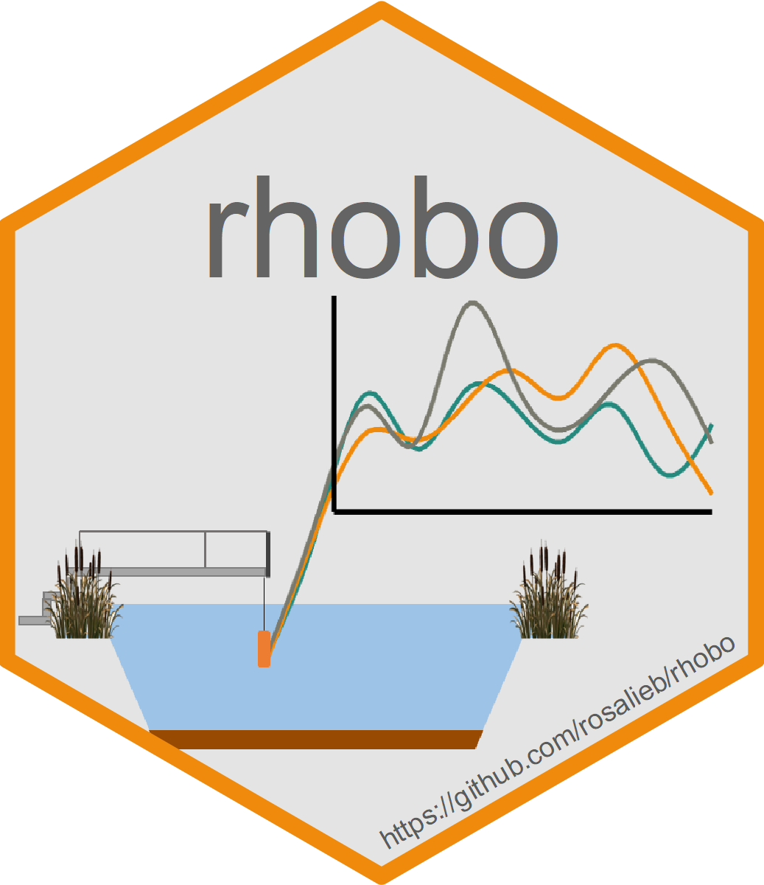

<!-- README.md is generated from README.Rmd. Please edit that file -->
<!-- badges: start -->
<!-- badges: end -->

# rhobo <a href="https://github.com/rosalieb/rhobo" target="_blank"></a>

The goal of rhobo is to read in the raw HOBO files downloaded through
the HOBO software and compute the dissolved oxygen correction factors.
Functions are also included to help append new data to previous data
files.

The steps match the routine for data from the artificial lakes at the
[CEREEP-Ecotron](https://www.cereep.bio.ens.psl.eu/spip.php?article45),
and may need to be adapted to other datasets format to be widely usable.

**Authors**: Rosalie Bruel (iEES-Paris, CNRS, France) and Sophie Guillon
(Mines ParisTech, France)

## Installation

You can install the development version from
[GitHub](https://github.com/) with:

    # install.packages("devtools")
    devtools::install_github("rosalieb/rhobo")
    library(rhobo)

## Example

None of the following code will run unless you have data in your home
folder. You can access the desired structure of the home repository by
running `struct.dir()`.

    #>  Structure of the directory: 
    #>  ('...' below refers to the path2data you gave in the 'path2data' argument.)
    #> 
    #>  .../PLANAQUA
    #>         |
    #>         |___ HOBO_Process
    #>         |       |
    #>         |       |___ old
    #>         |       |     |
    #>         |       |     |___ [all the previous file (.txt)]
    #>         |       |
    #>         |       |___ [most-recent file for each lake]
    #>         |
    #>         |___ HOBO_Raw
    #>                 |
    #>                 |___ 2021_07_27 (example name)
    #>                 |     |
    #>                 |     |___ [one file per lake (.txt)]
    #>                 |
    #>                 |___ [one folder per field mission]

### 1 - Set and check your input

First, you need to specify a certain number of inputs associated with
sensors deployment:

``` r
# Start editing here
foldername = "2021_07_27" # Name of the folder with data unloaded. Typically, folder named YYYY_MM_DD using the date of the field mission.
Append = format(as.Date(foldername, format = "%Y_%m_%d"), format = "%Y%m") # To respect the format, create the append that will be added to each QAQC'd file
TM_end = "2021/07/27 07:50:00" # Time measurement end # when probes are taken out of the lakes
TC_post = "2021/07/27 09:15:00" # Time calibration end of measurements (post deployment)
TC_pre = "2021/05/07 13:10:00" # Time calibration pre-deployment, after the calibration bucket # before measurements
TM_init = "2021/05/07 13:40:00" # Time measurement init # when probes are back in the lakes
Pbaro_mbar_init = 756.2 *1013/760 # P in millibar
Pbaro_mbar_end = 752.6 *1013/760 # P in millibar
# Stop editing here
```

The timeline below shows the succession of events: every 3 months or so,
the HOBO sensors are taken out of the water (TM\_end: time end
measurement), put in an oxygenated bucket for one hour (TC\_post: time
at the end of the hour, with theoretical measurements at max DO
saturation), cleaned, put back in the bucket for at least one hour
(TC\_pre: time at the end of the second “bath”), then re-deployed to the
lakes (TC\_init). This routine takes about half-a-day, and is indicated
in grey in the drawing below. On top of the 4 times that must be written
down (in UTC), the atmospheric pressure is also written down at the
moment of the two “baths”. Atmospheric pressure and water temperature
(measured by the HOBO sensors) are needed to calculate the theoretical
DO saturation.


We included a function, `rhobo.check.inputs()`, to help verify the
inputs look ok:

``` r
rhobo.check.inputs(path2data = path2data, foldername = foldername, 
                   TC_pre = TC_pre, TC_post = TC_post, 
                   TM_init = TM_init, TM_end = TM_end, 
                   Pbaro_mbar_init = Pbaro_mbar_init, 
                   Pbaro_mbar_end = Pbaro_mbar_end)
```

### 2 - Compute correction factor

#### 2.1 - Automated part

The dissolved oxygen correction factor are computed within the function
for each lake with available data. Check the function description
`?rhobo.CF` to see the details of each argument.

``` r
metadata_QAQC <- rhobo.CF(path2data = path2data, 
                          foldername = foldername,
                          TC_pre = TC_pre, TC_post = TC_post,
                          Pbaro_mbar_init = Pbaro_mbar_init, 
                          Pbaro_mbar_end = Pbaro_mbar_end, 
                          n = 4)
```

#### 2.2 - Manual part

You can then check the outputs using the function `pCF()`, and edit any
correction factor using the function `specify.DO()`. This step is
necessary as the function will not automatically adjust an outlier
correction factor. Typically, the correction factor shouldn’t be above
1.15 for example.

Note that the `pCF.all()` function goes in all the folders within the
folder *Hobo\_Raw* and find previous correction factor files. This
function won’t be useful the first time you use *rhobo*, but later on,
it will allow you to visualize the previous correction factors.

``` r
# Look at the plot and make sure there are no outliers for the correction factor
pCF(metadata_QAQC)
```

``` r
# If some values seems off, add a manual DO correction factor:
# Example, if we think the DO factor for "lac11" and "lacO1L" are too high at the end of the measurement:
metadata_QAQC <- specify.DO.CF(metadata_QAQC, "lac01L", "End", 1.05)
metadata_QAQC <- specify.DO.CF(metadata_QAQC, "lac11", "End", 1.05)
# Replace by NA if after all we were happy with the values for "lac01L":
metadata_QAQC <- specify.DO.CF(metadata_QAQC, "lac01L", "End", NA)

# Look at the plot again - old values are shown with higher transparency
pCF(metadata_QAQC)
```

<div class="figure">


<p class="caption">
Correction factor for dissolved oxygen measurements after manual edit.
</p>

</div>

If happy with the results, you will save the outputs by: - writing the
metadata (note that you can edit the output filename, but please leave
the pattern “DO\_Correction\_factor” at the beginning, as well as
Sys.Date() at the end, as this is what a later script recognize to
compute a plot.) - save the plot (optional)

``` r
# Write metadata
write.csv(metadata_QAQC, paste0(path2data, "/Hobo_Raw/", foldername, "/DO_Correction_factor_", Sys.Date(), ".csv"), 
          row.names = FALSE)

# Save plot
ggsave(paste0(path2data, "/Hobo_Raw/", foldername, "/DO_Correction_factor_plot_", Sys.Date(), ".png"),
       width = 8, height = 6)
```

### 3 - Append new files to previous files

Finally, this step allows you to go into the Hobo\_Process folder, find
the most-recent file for each lake, and append the new data. Old data
will be moved to the folder *Hobo\_Process/old*, and only the recent
most datasets will be kept in the *Hobo\_Process* folder.

``` r
all_data <- rhobo.append(metadata_QAQC, path2data, 
                         foldername, TM_init, TM_end)
```

### 4 - Supplementary tools

If you assign `rhobo.append()` output, you can then access to all the
most updated data.

The function `rhobo.treatments()` can then be used to assign the
treatments (read `?rhobo.treatments` for all the options) and do some
more detailed plots.

``` r
# Create a unique dataframe
hobo_all <- bind_rows(all_data)
# Assign treatments
hobo_all <- rhobo.treatments(hobo_all, lakename = "lac") 
```

The function `rhobo.treatments()` can be used for any dataframe.

``` r
metadata_QAQC <- rhobo.treatments(metadata_QAQC, lakename = 1)
#> -- Attaching packages --------------------------------------- tidyverse 1.3.1 --
#> v tibble  3.1.3     v purrr   0.3.4
#> v readr   2.0.1     v forcats 0.5.1
#> Warning: le package 'readr' a été compilé avec la version R 4.1.1
#> -- Conflicts ------------------------------------------ tidyverse_conflicts() --
#> x lubridate::as.difftime() masks base::as.difftime()
#> x lubridate::date()        masks base::date()
#> x dplyr::filter()          masks stats::filter()
#> x lubridate::intersect()   masks base::intersect()
#> x dplyr::lag()             masks stats::lag()
#> x lubridate::setdiff()     masks base::setdiff()
#> x lubridate::union()       masks base::union()
ggplot(metadata_QAQC, aes(TC_1, DO_correction_factor)) + 
  geom_hline(yintercept = 1, lty = 2) +
  geom_segment(metadata_QAQC %>% 
                 select(Lake, What, TC_1, DO_correction_factor, treatment) %>%
                   pivot_wider(id_cols = c(treatment, Lake), 
                               names_from  = What, 
                               values_from = c(TC_1, DO_correction_factor)),
                 mapping = aes(x = TC_1_Init, xend = TC_1_End, y = DO_correction_factor_Init, yend = DO_correction_factor_End),
                 lty =2, col = grey(.5)
    ) +
  geom_point() + facet_wrap(~treatment) +
  labs(x = "Date", y = "DO correction factor") 
```


